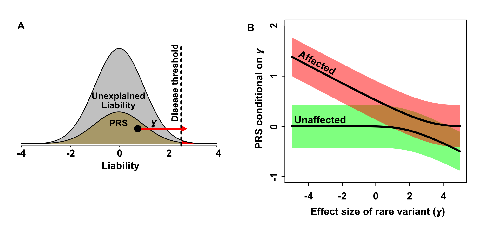
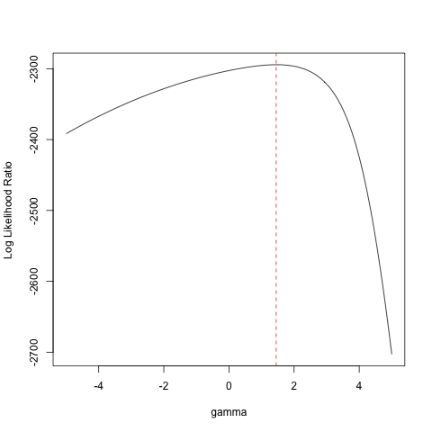

# Liability Threshold Burden Test (LTBT)
LTBT implements a novel rare-variant association test for binary traits that jointly models the contribution of rare variants and PRS under a liability threshold model. We define the total liability as the additive sum of rare-variant effect (γ), PRS, and unexplained risk factors (**Figure A**). Under a liability threshold model, the disease outcome is determined by whether an individual’s total liability is over the threshold determined by the prevalence of disease in population. By modeling the conditional distribution of PRS given the rare variant effect size γ (**Figure B**), we compare the likelihood of observed data under the null (γ=0) and alternative (γ≠0) hypotheses. 



For inquiries on LTBT, please contact Sung Chun (sung.g.chun@gmail.com). 

## Installation
LTBT is implemented as an R module. Please download and install [the LTBT R module](https://github.com/sgchun/ltbt/blob/main/ltbt_1.0.tar.gz) as below:
   ```bash
   R CMD install ltbt_1.0.tar.gz
   ```
## How to Run LTBT
We provide a deidentified summary-level sample test data [RTEL1.tsv](https://github.com/sgchun/ltbt/blob/main/RTEL1.tsv) and test code [test.r](https://github.com/sgchun/ltbt/blob/main/test.r). LTBT scans the likelihood space in a grid search. We recommend the search space of rare-variant effect (```gamma.seq```) as below. LTBT test (```run.ltbt()```) requires the genotypes, polygenic risk scores (PRS), outcomes for all subjects in a cohort, along with the disease prevalence in an unascertained population (```0.005``` in this case). The genotypes are encoded as 0 or 1, respectively, depending on whether an individual carries a functional rare variant or not. The PRS should be standardized to the mean of 0 and variance of 1 in an unascertained population. The outcomes are represented as 0 or 1 for controls and cases, respectively. 
   ```R
   library(ltbt)

   gamma.seq <- seq(-5, 5, 0.05)

   exdata <- read.delim("RTEL1.tsv", sep="\t")

   res <- run.ltbt(gamma.seq, exdata$gt, exdata$prs, exdata$outcome, 0.005)

   res$h2Lx
   # 0.1266585
   res$pvalue
   # 4.824949e-05
   res$gamma.mle
   # 1.45

   plot(res$gamma, res$logL, ty="l", xlab="gamma", ylab="Log Likelihood Ratio")
   abline(v=res$gamma.mle, col="red", lty=2)
   ```
LTBT returns the estimated heritability explained by PRS (```h2Lx```), p-value of nested likelihood ratio test (```pvalue```), and most likely effect size of rare variants (```gamma.mle```). The curve of log likelihood ratio can be plotted as shown below: 


## Data processing pipeline
We provide QC and data processing pipelines used in the IPF study (Chun et al.)
1. Discovery cohort (CGS-PF + UK Biobank)
   * [Allen2019.14SNPs.qctool.txt](https://github.com/sgchun/ltbt/blob/main/discovery/Allen2019.14SNPs.qctool.txt): 14-SNP PRS model for QCTools (Genome assembly: GRCh37).
   * [variant_qc.py](https://github.com/sgchun/ltbt/blob/main/discovery/variant_qc.py): Hail script for Whole-Exome Sequence variant QC for CGS-PF and UK Biobank based on DNA Nexus cloud platform.
   * [data-cleanup.cgspf-ukb.R](https://github.com/sgchun/ltbt/blob/main/discovery/data-cleanup.cgspf-ukb.R): Data harmonization codes for CGS-PF cases and UK Biobank controls.

3. Validation cohort (All of Us)
   * [Allen2019.13SNPs.b38.qctool.txt](https://github.com/sgchun/ltbt/blob/main/validation/Allen2019.13SNPs.b38.qctool.txt): 13-SNP PRS model for QCTools (Genome assembly: GRCh38). One SNP in 14-SNP PRS model (rs2077551) is missing in All of Us ACAF variant set.
   * [Calculate_PRS.py](https://github.com/sgchun/ltbt/blob/main/validation/Calculate_PRS.py): Hail-based PRS calculation script for All of Us Workbench cloud platform.
   * [data-cleanup.allofus.py](https://github.com/sgchun/ltbt/blob/main/validation/data-cleanup.allofus.py): Case/control definition script for All of Us Workbench cloud platform. 

## Citation
> Sung Chun*, Ahmad Samiei, Lauren Flynn, Heidi Makrynioti, Matthew Moll, Anna L. Peljto,
> David A. Schwartz, Michael H Cho, Shamil R Sunyaev, Ivan O Rosas, Gary M. Hunninghake,
> and Benjamin A Raby*. A new liability-based rare-variant burden test identifies a novel
> genetic association between HTRA3 and idiopathic pulmonary fibrosis. 
> (Preprint will be available soon)  
> * Joint correspondence.

